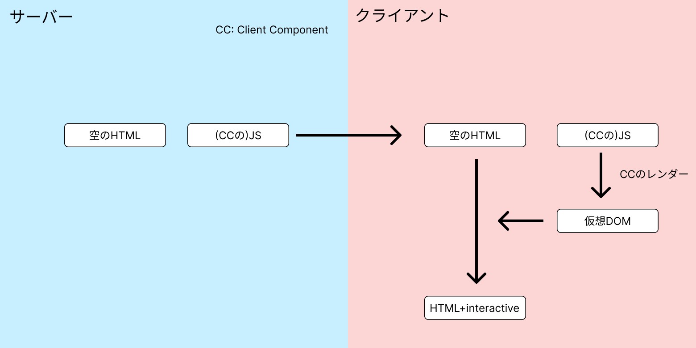
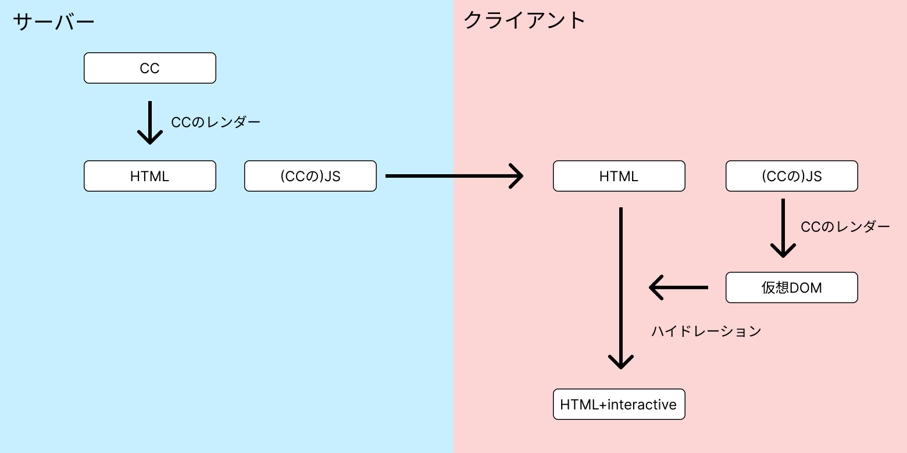
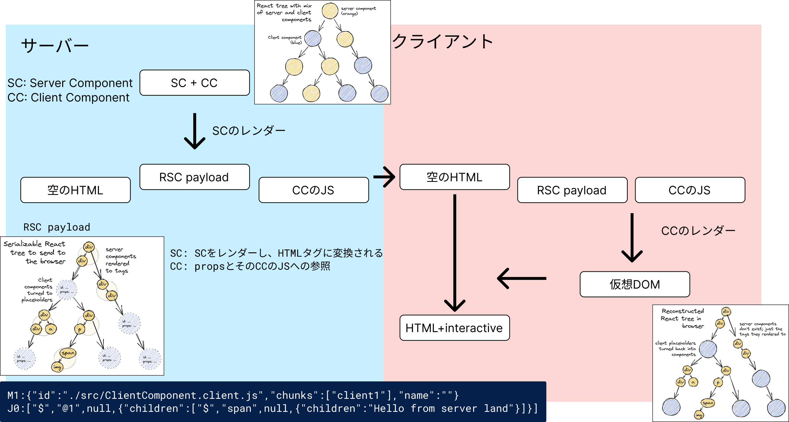
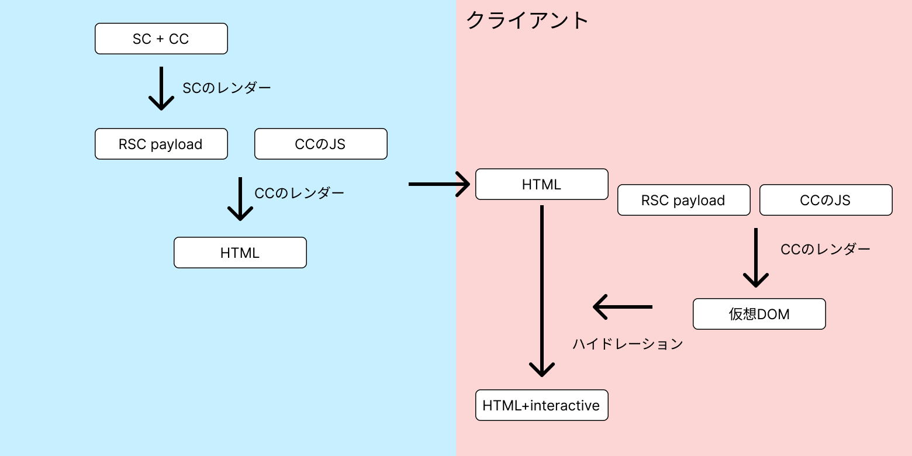

# React Server Component

2025/9/5 平野大介

---

# はじめに

React Server Component とは、Server Component と Client Component を組み合わせてレンダリングするアーキテクチャ

RSC でのレンダリングの流れを理解するために、4 つのレンダリング手法を説明します。

1. 従来型（SSR/SSG なし）
2. 従来型（SSR/SSG あり）
3. RSC（SSR/SSG なし）← ゴール
4. RSC（SSR/SSG あり）おまけ

※ SSR/SSG とは、リクエスト時またはビルド時にサーバーで HTML を生成する手法

---

# 1. 従来型（SSR/SSG なし）

空の HTML をクライアントに送り、クライアント側でレンダリングを行う方法

---

# 2. 従来型（SSR/SSG あり）

サーバーで HTML を生成して、クライアント側でハイドレーションを行う方法

---

# 3. RSC（SSR/SSG なし）

ツリーの画像は [React Server Components の仕組み：詳細ガイド](https://postd.cc/how-react-server-components-work/) より引用

---

# 4. RSC（SSR/SSG あり）

---

# まとめ

- RSC と SSR/SSG を分けて考えると理解しやすい
- 同じ「レンダリング」でも目標成果物が違うのが難しいポイント
  - 仮想 DOM
  - HTML
  - RSC payload

## Next step

- Nextjs のキャッシュ + プリフェッチ
- Streaming SSR
- Partial Pre-Rendering

---

# おまけ：Nextjs のキャッシュ

---

# 参考

- [React Server Components を理解したい](https://zenn.dev/yuu104/articles/react-server-component)
- [React Server Components の仕組み：詳細ガイド](https://postd.cc/how-react-server-components-work/)
- [一言で理解する React Server Components](https://zenn.dev/uhyo/articles/react-server-components-multi-stage)
- [Caching in Next.js](https://nextjs.org/docs/app/guides/caching)
