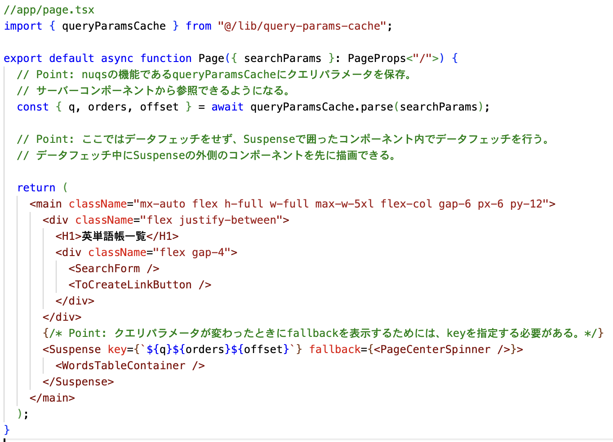
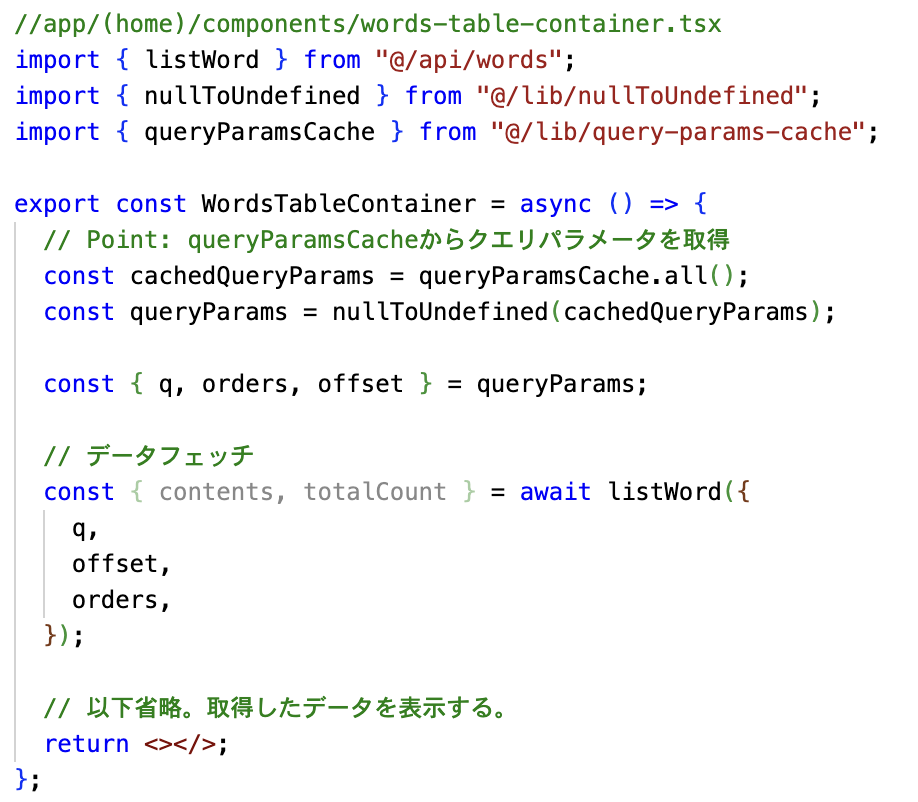
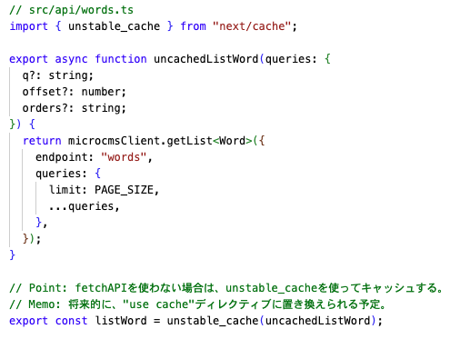
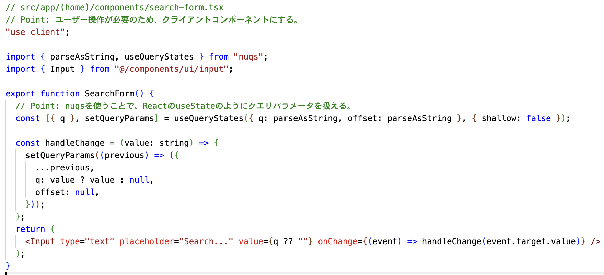
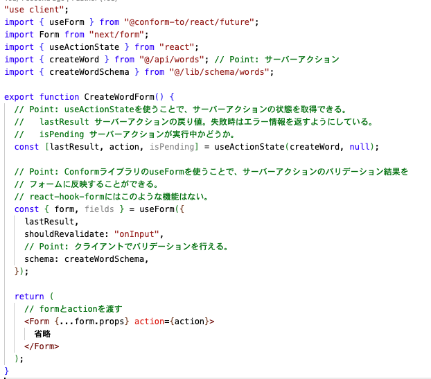
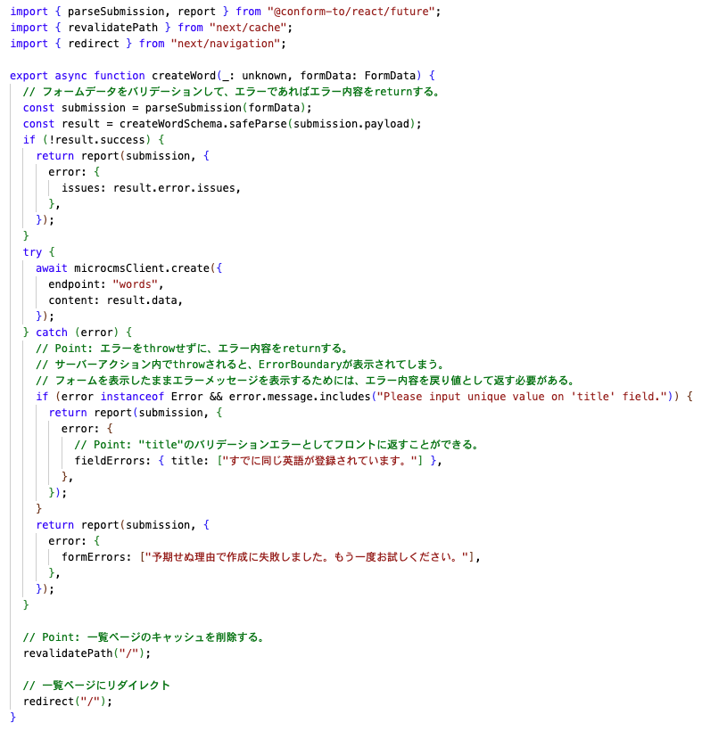

# データフェッチハンズオン 【Next.js App Router】

2025/10/17 平野大介

---

# Next.js App Router

- React Server Component や Server Action といった機能をサポート

- データの READ はサーバーコンポーネントで行う。
- データの CREATE,UPDATE,DELETE は Server Action で行う。

---

# 作ったもの

- 一覧画面
  - 検索,ソート,ページネーション
  - 削除
- 作成画面
- 編集画面

レポジトリ：https://github.com/nebular-lab/word-book
デプロイ：https://word-book-two.vercel.app

---

一覧画面(と時間があれば作成画面)について説明します。

---

# 一覧画面の方針

- 検索・ソート・ページネーションの状態はクエリパラメータで管理する。
  - 例：/?q=test&order=author&offset=25
  - クエリパラメータを型安全に使うために、[nuqs](https://nuqs.dev/) を使う
- 検索・ソート・ページネーションをする場合、そのクエリパラメータの URL へ遷移する。
- サーバーコンポーネントでクエリパラメータを読み取ってデータフェッチする。
- MicroCMS の API の取得結果はキャッシュする。(Data Cache を活用)
- ローディング中はテーブルの代わりにスピナーを表示する。

---

---

  
  

---

---

# 作成画面の方針

- サーバーアクションから MicroCMS の作成 API を叩く
- サーバーアクションでのバリデーションエラーをフォームに表示するために、[Conform](https://conform.guide/)を使う。
- 作成に成功したら一覧画面のデータキャッシュを削除する

---

  
  

---

# 感想

### 良かった点

- useState が一度も登場せず、とてもシンプルに書けた。
- nuqs と conform が使いやすい。

### 良くなかった点

- Router Cache と Data Cache の使い分け方がよくわからなかった。
- クエリパラメータの組み合わせごとに Data Cache していたら、キャッシュがたまり過ぎてしまって良くないことが起こりそう。
- Link コンポーネント による prefetch が並列で走るとパフォーマンスが悪くなる。

→ [Dynamic IO](https://nextjs.org/blog/our-journey-with-caching) (キャッシュをシンプルにするための機能)に期待
